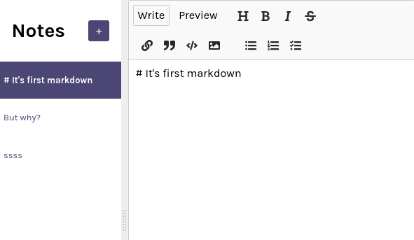

# notes-app-react

> Markdown Editor built on React with [react-mde library](https://github.com/andrerpena/react-mde) with [Google Firebase](https://firebase.google.com/) database.
> Live demo [_here_](https://sashauly.github.io/notes-app-react/).

## Table of Contents
- [notes-app-react](#notes-app-react)
  - [Table of Contents](#table-of-contents)
  - [General Information](#general-information)
  - [Technologies Used](#technologies-used)
  - [Features](#features)
  - [Setup](#setup)
  - [Project Status](#project-status)
  - [Room for Improvement](#room-for-improvement)
  - [Acknowledgements](#acknowledgements)
  - [Contacts](#contacts)

## General Information
- This is markdown editor built on React with [react-mde library](https://github.com/andrerpena/react-mde) with [Google Firebase](https://firebase.google.com/) database.
- Serve only for educational purposes to get familiar with React hooks(useState, useEffect).

## Technologies Used
- JavaScript ES6
- [React 17.0.2](https://react.dev/)
- [react-mde 11.5.0](https://github.com/andrerpena/react-mde)
- [react-split 2.0.14](https://uiwjs.github.io/react-split/)
- [Firebase](https://firebase.google.com/)
- [vite 4.4.0](https://vitejs.dev/)

## Features
- Ability to add, update and delete notes
- Preview markdown on separate tab

## Setup
Just open [the live version](https://sashauly.github.io/notes-app-react/). For now this project served for presentation purposes

## Project Status
Project is: _in progress_

## Room for Improvement

Room for improvement:
- Check debouncing for user input
- Add sorting by update time

## Acknowledgements
- This project was based on [this Scrimba course tutorial](https://scrimba.com/learn/learnreact).

## Contacts

Created by [@sashauly](https://t.me/sashauly) - feel free to contact me!
