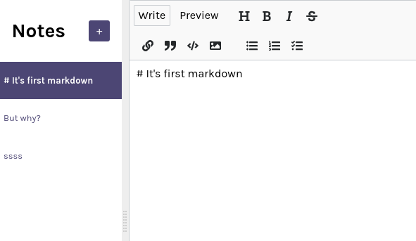

# заметки-приложение-реагируют

> Редактор Markdown, построенный на React с[библиотека реакции mde](https://github.com/andrerpena/react-mde)с[Google Firebase](https://firebase.google.com/)база данных.
> Живая демонстрация[_здесь_](https://sashauly.github.io/notes-app-react/).

## Оглавление

-   [заметки-приложение-реагируют](#notes-app-react)
    -   [Оглавление](#table-of-contents)
    -   [Общая информация](#general-information)
    -   [Используемые технологии](#technologies-used)
    -   [Функции](#features)
    -   [Setup](#setup)
    -   [Статус проекта](#project-status)
    -   [Возможности для совершенствования](#room-for-improvement)
    -   [Благодарности](#acknowledgements)
    -   [Контакты](#contacts)

## Общая информация

-   Это редактор уценки, построенный на React с[библиотека реакции mde](https://github.com/andrerpena/react-mde)с[Google Firebase](https://firebase.google.com/)база данных.
-   Служить только в образовательных целях, чтобы ознакомиться с хуками React (useState, useEffect).

## Используемые технологии

-   JavaScript ES6
-   [Реагировать 17.0.2](https://react.dev/)
-   [реакция-mde 11.5.0](https://github.com/andrerpena/react-mde)
-   [реакция-сплит 2.0.14](https://uiwjs.github.io/react-split/)
-   [Firebase](https://firebase.google.com/)

## Функции

-   Возможность добавлять, обновлять и удалять заметки
-   Предварительный просмотр уценки на отдельной вкладке

## Настраивать

Просто откройте[живая версия](https://sashauly.github.io/notes-app-react/). Пока этот проект служил для презентационных целей

## Статус проекта

Проект:_в ходе выполнения_

## Возможности для совершенствования

Возможности для совершенствования:

-   Проверка устранения дребезга для пользовательского ввода
-   Добавить сортировку по времени обновления

## Благодарности

-   Этот проект был основан на[это руководство по курсу Scrimba](https://scrimba.com/learn/learnreact).

## Контакты

Сделано[@сашоли](https://t.me/sashauly)- Не стесняйтесь обратиться ко мне!
